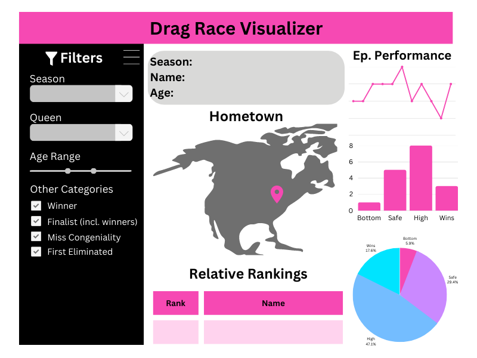

# dragracerviz

This dashboard is hosted on `shinyapps.io`, [here](https://wispyisle.shinyapps.io/dragracer-dashboard/).

## Contributors

-   Marian Agyby
-   Shaun Hutchinson
-   Dhruvi Nishar
-   Caroline Tang

## Motivation

With each new season of RuPaul's Drag Race, it can be harder to keep track of how well each contestant did on their respective season. On the original US version of the show alone, there have been 14 completed seasons and over 180+ drag queens who have competed on the show. Since appearing on the show, many of these queens' drag shows have increased in popularity, and some have also gone on tours.

Fans of the show may be interested in going to watch some of these queens perform live, whether it is a queen from their hometown, or someone going on tour. However, with so many queens, and a limited budget to spend on tickets to shows, it may help to see how well queens performed on the show to determine who to go watch. This app will visualize the performance of a queen during their season, and allows users to compare different queens within a particular season. Users will also be able to see what cities the different queens are from.

## App Description

Opening the dashboard will give an overview of how drag queens performed in a particular season of RuPaul's Drag Race (default season 1). The center of the dashboard will contain a map marked with their hometowns. When hovered over, each marker will display basic information about the queen from that city, such as their name and age when they competed on the season. There will also be a table below the map that will show the queen's relative rankings. On the right side of the map, users will be able to see how well each queen performed in each episode of the season on a line graph, in terms of whether they placed relatively higher or lower compared to the other queens. Users can also filter for particular queens by name, age, or other categories like whether they won the season, if they were given the title of 'Miss Congeniality', or if they were the first to be eliminated on their season. When filtering for a particular queen, users can also see how many times a queen won, was safe, or was in the bottom on their season, both as counts and as percentages.

