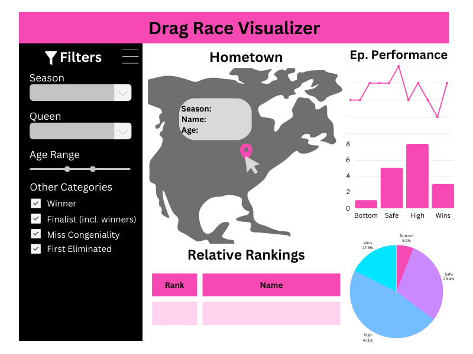

# dragracerviz


This dashboard is hosted on `shinyapps.io`, [here](https://wispyisle.shinyapps.io/dragracer-dashboard/).

## Contributors

-   Marian Agyby
-   Shaun Hutchinson
-   Dhruvi Nishar
-   Caroline Tang

## Motivation

With each new season of RuPaul's Drag Race, it can be harder to keep track of how well each contestant did on their respective season. On the original US version of the show alone, there have been 14 completed seasons and over 180+ drag queens who have competed on the show. Since appearing on the show, many of these queens' drag shows have increased in popularity, and some have also gone on tours.

Fans of the show may be interested in going to watch some of these queens perform live, whether it is a queen from their hometown, or someone going on tour. However, with so many queens, and a limited budget to spend on tickets to shows, it may help to see how well queens performed on the show to determine who to go watch.

They may also have questions such as:

1.  What was the progression of each drag queen on each season?

2.  Which drag queen has the the most wins across all seasons?

3.  Who was the youngest drag queen on any season?

4.  Which drag queens came from each state?

This app will visualize the performance of a queen during their season, and allows users to compare different queens within a particular season. Users will also be able to see what cities the different queens are from.

## App Description

Opening the dashboard will give an overview of how drag queens performed in a particular season of RuPaul's Drag Race (default season 1). The center of the dashboard will contain a map marked with their hometowns. When hovered over, each marker will display basic information about the queen from that city, such as their name and age when they competed on the season. There will also be a table below the map that will show the queen's relative rankings. On the right side of the map, users will be able to see how well each queen performed in each episode of the season on a line graph, in terms of whether they placed relatively higher or lower compared to the other queens. Users can also filter for particular queens by name, age, or other categories like whether they won the season, if they were given the title of 'Miss Congeniality', or if they were the first to be eliminated on their season. When filtering for a particular queen, users can also see how many times a queen won, was safe, or was in the bottom on their season, both as counts and as percentages.

## Usage
To use the dashboard, simply visit the deployed link and explore the data. Users can interact with the map, table, and line graph to explore the data and filter by different categories.

Deployed link: [https://wispyisle.shinyapps.io/dragracer-dashboard/](https://wispyisle.shinyapps.io/dragracer-dashboard/)



## Contributing
If you are interested in contributing to this project, please follow these steps:

- Fork the repository and clone it to your local machine.
- Create a new branch for your work.
- Make your changes and commit them with clear commit messages.
- Push your changes to your fork.
- Submit a pull request with a clear description of your changes.

Contributors are welcome to work on any part of the dashboard, including adding new features, improving the user interface, or fixing bugs. If you are looking for ideas for how to contribute, please see the issues section of the repository for a list of current issues that need attention. 
Note that all contributions must abide by our [guidelines](CONTRIBUTING.md) and [Code of Conduct](CODE_OF_CONDUCT.md).

### To run the app locally, follow these steps:

- Install R and RStudio on your local machine.
- Clone the repository to your local machine.
- Open the project in RStudio.
- Install the necessary packages by running 
```
install.packages(c("shiny", "shinydashboard", "tidyverse", "leaflet", "plotly", "DT", "viridis", "thematic", "bslib", "shnycssloaders", "shinytest2"))
```
- Run the app by clicking the 'Run App' button in the RStudio console.

Thank you for your interest in contributing to dragracerviz!

### Glossary
- README file: a document that introduces an open project to the public and any potential contributors
- repository or repo: a collection of documents related to your project, in which you create and save new code or content
- Roadmap: a document outlining the schedule of work to be done on a project
- Milestone: an event or state marking a specific stage in development on the project
- Issue: the GitHub term for tasks, enhancements, and bugs for your projects
